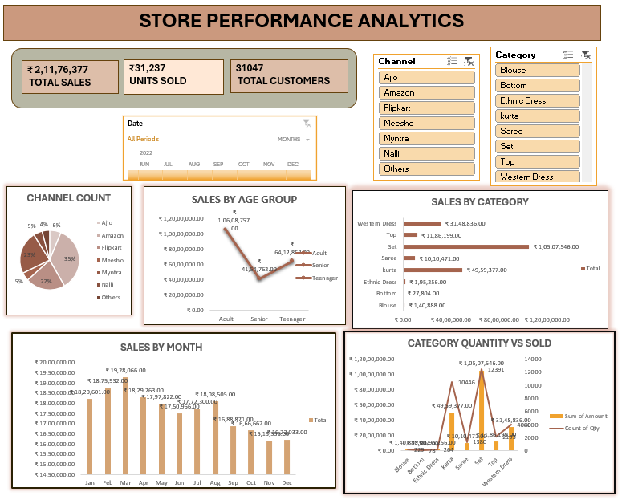

# Store Performance Analytics Dashboard - Excel

## Project Overview

The Store Performance Analytics Dashboard is an interactive Microsoft Excel dashboard developed to analyze retail store performance using sales data. The dashboard provides business insights into sales trends, customer distribution, product categories, and sales channels through dynamic visualizations and interactive filters.

Designed for business reporting, this project demonstrates how Excel can be used to transform raw transactional data into meaningful insights that support data-driven decision-making.

---

## Dashboard Preview

> Add a screenshot of your dashboard here.

```markdown

```

---

## Objectives

- Monitor overall store performance.
- Analyze sales across different channels.
- Compare category-wise sales performance.
- Evaluate customer distribution.
- Track monthly sales trends.
- Enable interactive analysis through filters.

---

## Key Performance Indicators (KPIs)

| KPI | Value |
|------|-------:|
| Total Sales | ₹2,11,76,377 |
| Units Sold | 31,237 |
| Total Customers | 31,047 |

---

## Dashboard Features

### Interactive Filters

- Date
- Sales Channel
- Product Category

### Visualizations

- Channel Distribution
- Sales by Age Group
- Sales by Category
- Monthly Sales Trend
- Category Quantity vs Sales

---

## Tools & Technologies

- Microsoft Excel
- Pivot Tables
- Pivot Charts
- Slicers
- Conditional Formatting
- Excel Formulas
- Data Visualization

---

## Skills Demonstrated

- Data Cleaning
- Data Analysis
- Dashboard Design
- KPI Reporting
- Interactive Reporting
- Pivot Table Analysis
- Business Intelligence
- Data Visualization

---

## Business Insights

- Analyze total sales, units sold, and customer count.
- Compare the contribution of different sales channels.
- Identify the highest-performing product categories.
- Monitor monthly sales trends to identify seasonal demand.
- Evaluate customer distribution across age groups.
- Support business decision-making using interactive dashboard filters.

---

## Project Structure

```
Store-Performance-Analytics-Excel-Dashboard/
│
├── Store Performance Analytics.xlsx
├── README.md
├── STORE.png
├── Dataset/
│   └── Store_Sales_Data.xlsx
└── LICENSE
```

---

## Future Enhancements

- Profit and margin analysis
- Regional sales comparison
- Sales forecasting
- Customer segmentation
- Automated reporting using Power Query
- Interactive executive summary dashboard

---

## Author

**Nisha P**

B.Sc. Data Science

Data Analytics | Microsoft Excel | Business Intelligence
